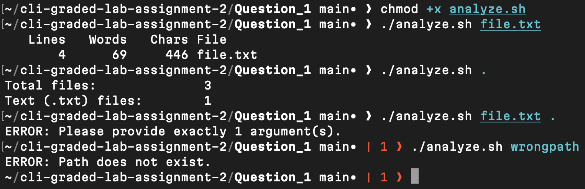

# Question 1

```
$ chmod +x analyze.sh
```
- Granted execute permission so the script can run from the terminal.

[analyze.sh](analyze.sh)

---
```
$ ./analyze.sh file.txt
```
- Executed the script with a file argument and observed line, word, and character statistics.

[file.txt](file.txt)

---
```
$ ./analyze.sh .
```
- Executed the script with a directory argument and observed total file count and .txt file count.

---
```
$ ./analyze.sh file.txt .
```
- Ran the script with incorrect argument numbers to verify error handling.

---
```
$ ./analyze.sh wrongpath
```
- Tested validation logic to confirm an error message appears when the path is missing.

---

