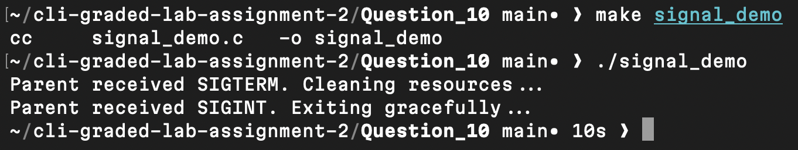

# Question 10

```
$ make signal_demo
```
- Compiled the program into an executable binary.

[signal_demo.c](signal_demo.c)

---
```
$ ./signal_demo
```
- Started the parent process which waits indefinitely while children send signals at different times.
- Wait 5 seconds to observe SIGTERM handling, then 10 seconds to observe SIGINT handling and graceful exit.

[signal_demo](signal_demo)

---

