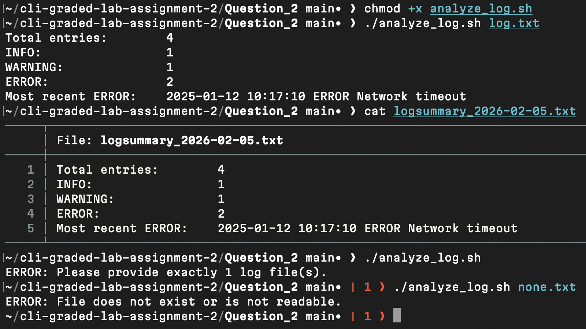

# Question 2

```
$ chmod +x analyze_log.sh
```
- Enabled execution permission for the script.

[analyze_log.sh](analyze_log.sh)

---
```
$ ./analyze_log.sh log.txt
```
- Executed the script to count entries, classify levels, detect the latest ERROR, and generate the report file.

[log.txt](log.txt)

---
```
$ cat logsummary_2026-02-05.txt
```
- Displays the contents of the generated report file to verify the summary and most recent ERROR entry were written correctly.

[logsummary_2026-02-05.txt](logsummary_2026-02-05.txt)

---
```
$ ./analyze_log.sh
```
- Verified validation logic by running without the required parameter.

---
```
$ ./analyze_log.sh none.txt
```
- Confirmed error handling when the input file does not exist.

---

