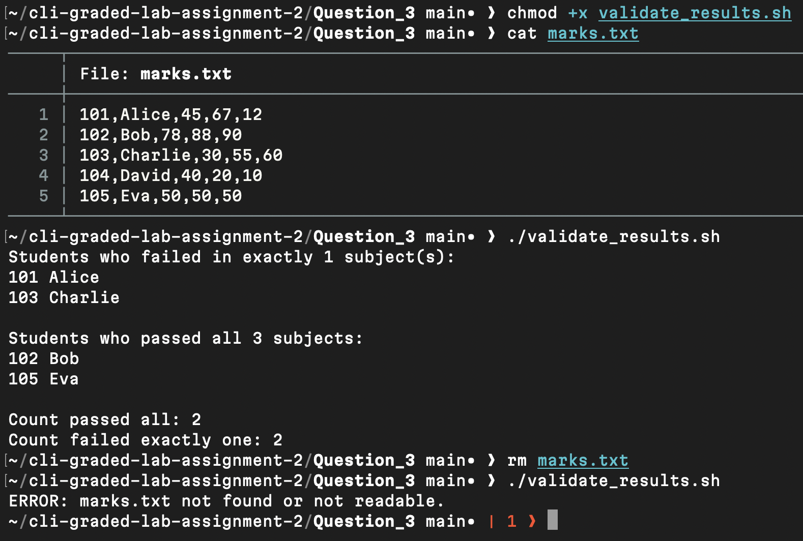

# Question 3

```
$ chmod +x validate_results.sh
```
- Granted execute permission so the script can run from the terminal.

[validate_results.sh](validate_results.sh)

---
```
$ cat marks.txt
```
- Verified the input data file to simulate student records.

[marks.txt](marks.txt)

---
```
$ ./validate_results.sh
```
- Executed the script to categorize students based on passing criteria and display counts.

---
```
$ rm marks.txt
```

```
$ ./validate_results.sh
```
- Verified validation logic by running without the required parameter.

---

