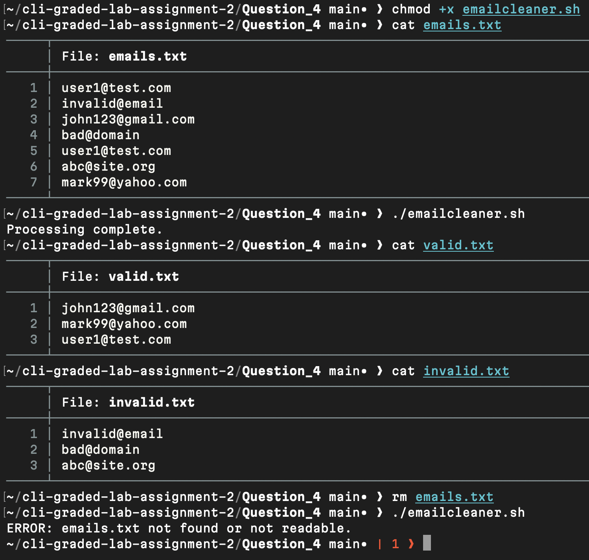

# Question 4

```
$ chmod +x emailcleaner.sh
```
- Granted execute permission to allow script execution.

[emailcleaner.sh](emailcleaner.sh)

---
```
$ cat emails.txt
```
- Validated the input file containing email entries for validation testing.

[emails.txt](emails.txt)

---
```
$ ./emailcleaner.sh
```
- Executed the script to extract valid emails into `valid.txt`, invalid entries into `invalid.txt`, and remove duplicates using sort and uniq.

---
```
$ cat valid.txt
```

```
$ cat invalid.txt
```
- Displayed filtered outputs to verify pattern matching and deduplication.

[valid.txt](valid.txt)  
[invalid.txt](invalid.txt)

---
```
$ rm emails.txt
```

```
$ ./emailcleaner.sh
```
- Verified error handling when the required input file is absent.

---

