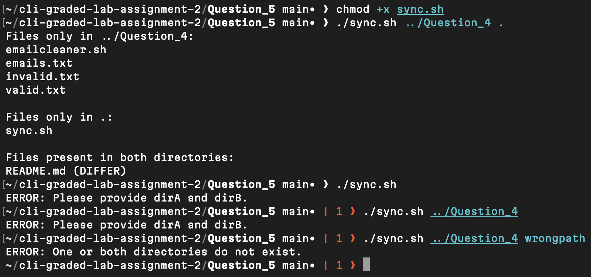

# Question 5

```
$ chmod +x sync.sh
```
- Granted execute permission so the script can run.

[sync.sh](sync.sh)

---
```
$ ./sync.sh ../Question_4 .
```
- Executed the script to list exclusive files and compare shared filenames using content checks.

---
```
$ ./sync.sh
```

```
$ ./sync.sh ../Question_4
```
- Verified validation logic for incorrect argument count.

---
```
$ ./sync.sh ../Question_4 wrongpath
```
- Confirmed error handling when one directory does not exist.

---

