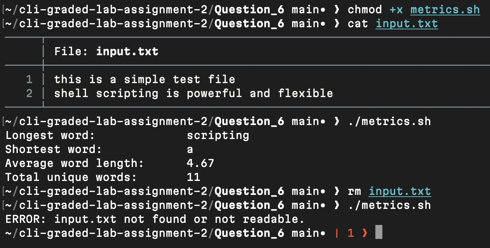

# Question 6

```
$ chmod +x metrics.sh
```
- Granted execute permission so the script can run.

[metrics.sh](metrics.sh)

---
```
$ cat input.txt
```
- Displayed the text file containing words for analysis testing.

[input.txt](input.txt)

---
```
$ ./metrics.sh
```
- Executed the script to extract words, compute lengths, and count unique entries using pipes and standard commands.

---
```
$ rm input.txt
```

```
$ ./metrics.sh
```
- Verified error handling when the required input file is absent.

---

