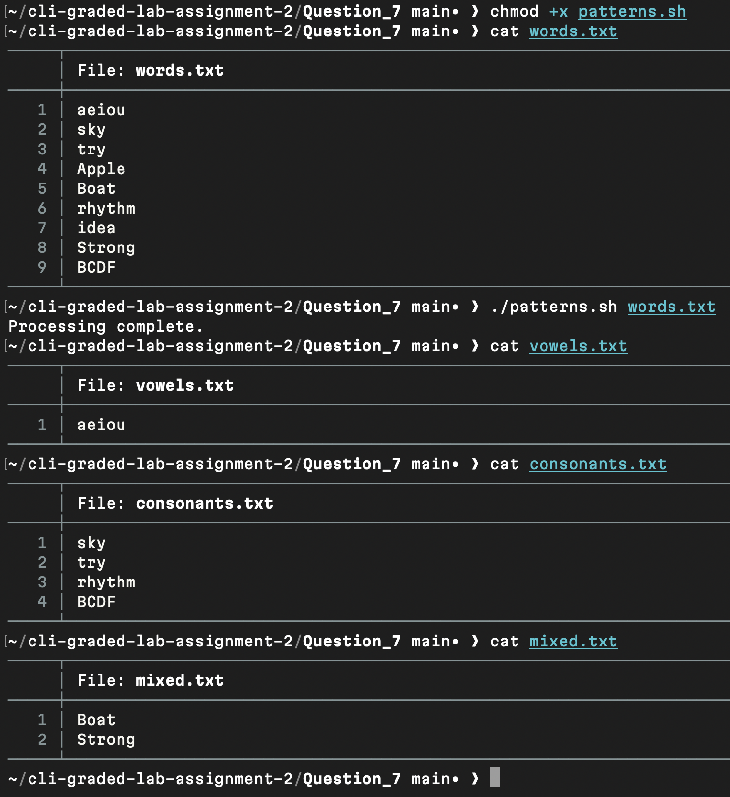
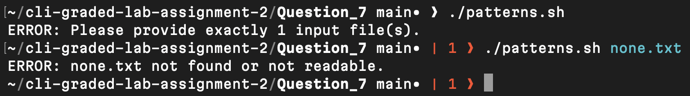

# Question 7

```
$ chmod +x patterns.sh
```
- Granted execute permission so the script can run.

[patterns.sh](patterns.sh)

---
```
$ cat words.txt
```
- Displayed the text file containing words for pattern testing.

[words.txt](words.txt)

---
```
$ ./patterns.sh words.txt
```
- Executed the script to filter words into `vowels.txt`, `consonants.txt`, and `mixed.txt` using case-insensitive pattern matching.

---
```
$ cat vowels.txt
```

```
$ cat consonants.txt
```

```
$ cat mixed.txt
```
- Displayed categorized outputs to verify regex filtering.


[vowels.txt](vowels.txt)  
[consonants.txt](consonants.txt)  
[mixed.txt](mixed.txt)

---
```
$ ./patterns.sh
```

```
$ ./patterns.sh none.txt
```
- Verified validation logic for missing argument and missing file.


