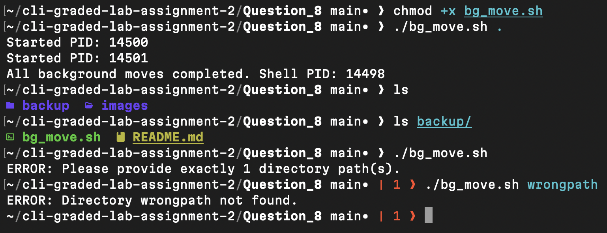

# Question 8

```
$ chmod +x bg_move.sh
```
- Granted execute permission so the script can run.

[bg_move.sh](bg_move.sh)

---
```
$ ./bg_move.sh .
```
- Executed the script to move files into backup/ using background jobs, display each PID, and wait for completion.

---
```
$ ls
```

```
$ ls backup
```
- Confirmed files were moved and backup directory was created.

[backup](backup)

---
```
$ ./bg_move.sh
```

```
$ ./bg_move.sh wrongpath
```
- Verified validation logic for missing argument and non-existent directory.

---

