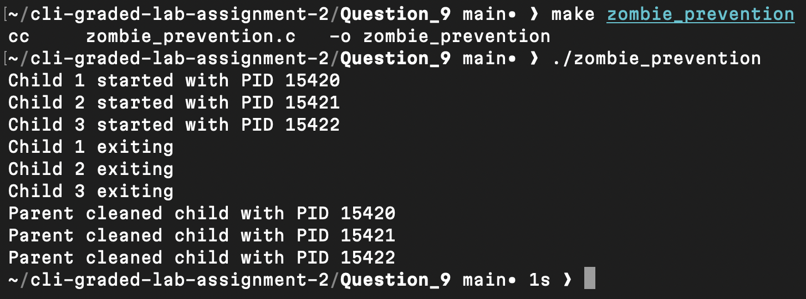

# Question 9

```
$ make zombie_prevention
```
- Compiled the source code into an executable binary.

[zombie_prevention.c](zombie_prevention.c)

---
```
$ ./zombie_prevention
```
- Executed the program to create multiple child processes and observe parent cleanup messages.

[zombie_prevention](zombie_prevention)

---

